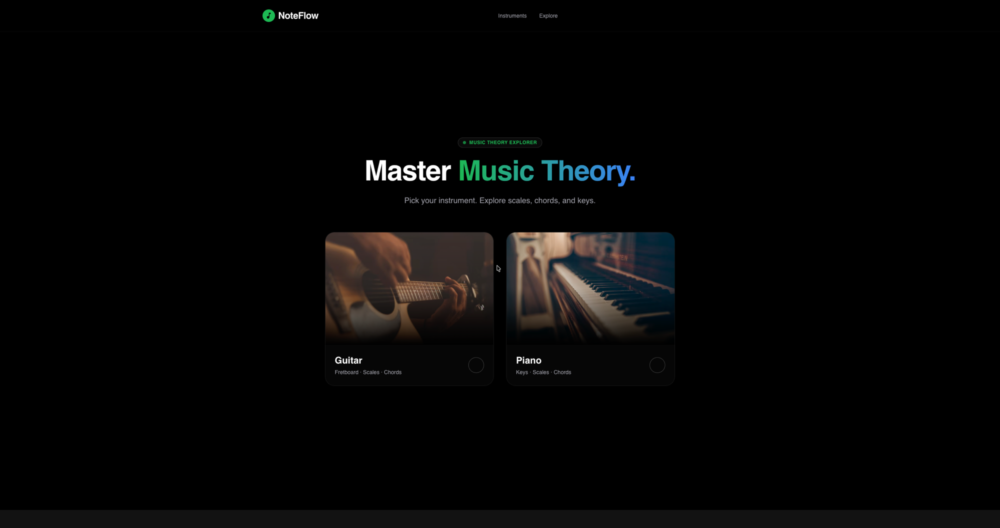
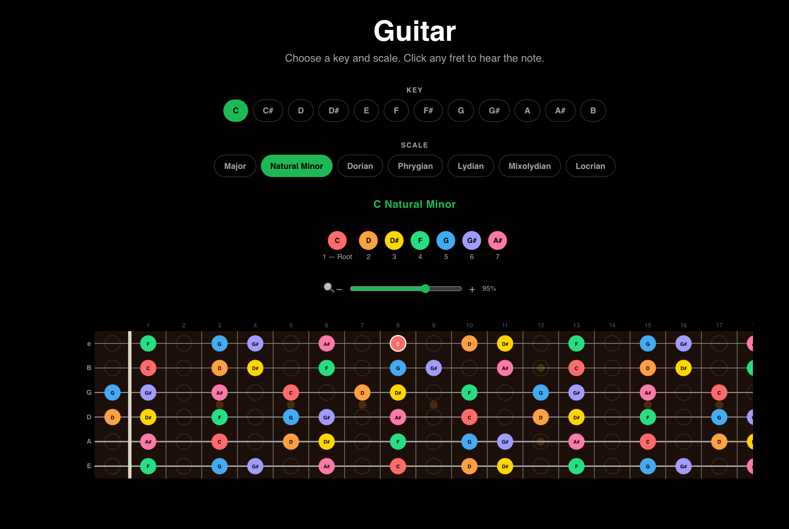
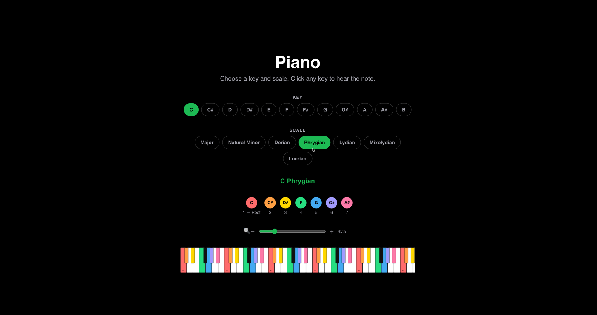
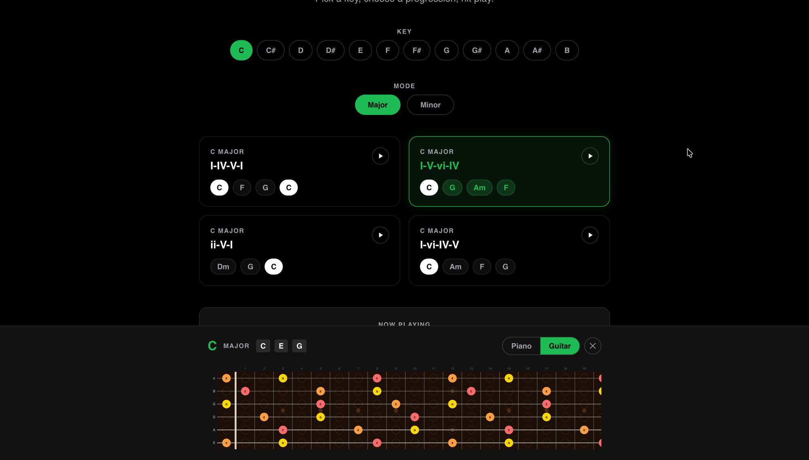
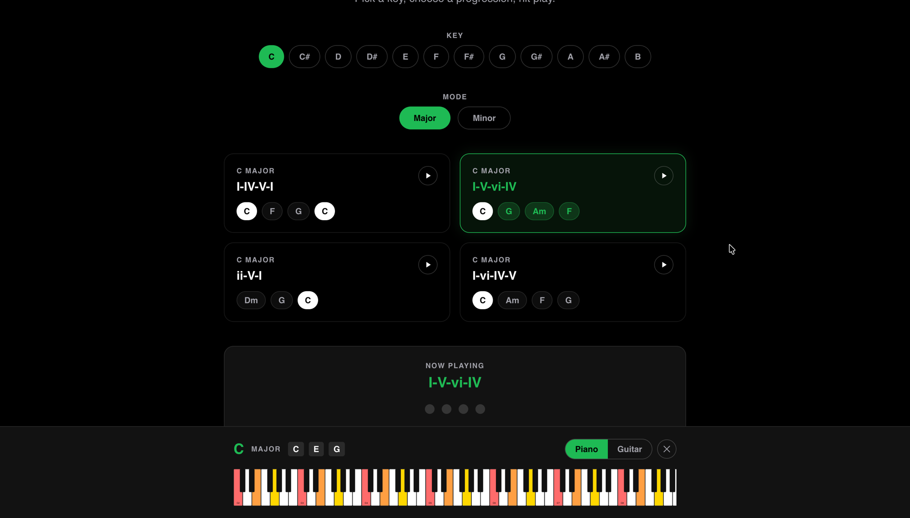

# NoteFlow — Music Theory Explorer

A music theory engine with a visual frontend and event streaming. Built as a portfolio project across a modern stack — no shortcuts.

Every scale recommendation, every interval calculation, every chord parse is done by hand-written Java logic. The music theory is **encoded into the software**.

---

## Screenshots

**Landing page**



**Guitar fretboard** — scale degree color coding, click any fret to hear the note



**Piano keyboard** — same color encoding, same legend, different instrument



**Chord progressions** — pick a key and mode, play any progression, click a chord to see it on guitar or piano





---

## Stack

| Layer | Technology |
|-------|-----------|
| Backend | Java 21 + Spring Boot 4 |
| Music engine | Custom domain logic (no external music libraries) |
| Frontend | React + Tailwind, served via nginx |
| Event streaming | Apache Kafka 3.7 (KRaft mode, no Zookeeper) |
| Observability | Datadog APM + distributed tracing + structured JSON logs |
| Container | Docker multi-stage build |
| Cloud | AWS ECS Fargate + RDS + CloudFront |

---

## Architecture

```
Browser
  ↓
React frontend (NoteFlow UI)
  ↓ HTTP
Spring Boot API  (:8081)
  ├── MusicTheoryController        (@RestController, /api/*)
  ├── ChordProgressionController   (@RestController, /api/progressions/*)
  ├── MusicTheoryService
  ├── ChordProgressionService
  ├── ChordParser                  (regex → Chord model)
  ├── ScaleRecommendationEngine
  └── NoteEventProducer            (publishes to Kafka on each request)
        ↓
      Kafka  (note-events topic)
        ↓
      NoteEventConsumer            (@KafkaListener)
```

---

## Endpoints

| Method | Path | Description |
|--------|------|-------------|
| `GET` | `/api/chords/{symbol}` | Parse a chord symbol, return notes. e.g. `Dm7` |
| `GET` | `/api/scale/{root}/{type}` | Get a single scale. e.g. `C/ionian` |
| `GET` | `/api/scales/{root}/{type}` | Get all compatible scales for a chord |
| `GET` | `/api/keys/{key}` | Get all notes in a major key |
| `POST` | `/api/improvise` | Given a chord, return compatible scales for improvisation |
| `GET` | `/api/progressions?key=C&mode=major` | Get diatonic chord progressions for a key |
| `GET` | `/api/progressions/chord/{symbol}` | Get the notes that make up a chord |

---

## Running locally

### Prerequisites

- Java 21+
- Maven 3.9+
- Node.js 18+
- PostgreSQL 14+ running on `localhost:5432`

### 1. Start the backend

```bash
# Create the database (run once)
psql -U postgres -c "CREATE USER noteflow WITH PASSWORD 'noteflow';"
psql -U postgres -c "CREATE DATABASE noteflow OWNER noteflow;"

# Start the API — Kafka listener is disabled in the local profile
SPRING_PROFILES_ACTIVE=local mvn spring-boot:run
```

The API will be available at `http://localhost:8081`.

### 2. Start the frontend

```bash
cd music_streaming-entertainment-modern_react
npm install
npm start
```

Open `http://localhost:3000`. The dev server proxies `/api/` calls to the backend automatically.

---

## Running with Docker (optional)

**Mac (Docker Desktop):** Install [Docker Desktop](https://www.docker.com/products/docker-desktop/), make sure it's running, then:

**Mac (Colima):** Run `colima start` first, then the same commands below.

**Linux:** Install Docker Engine, then the same commands below. No extra steps.

**Windows:** Install Docker Desktop with the WSL2 backend. Run all commands inside a WSL2 terminal.

```bash
# Build both images
docker build -t music-theory-api:0.1.0 .
docker build -t music-theory-ui:0.1.0 ./music_streaming-entertainment-modern_react

# Start everything
docker compose up
```

Open `http://localhost:3000`.

```bash
# Stop
docker compose down
```

---

## Running on Kubernetes (optional)

**Prerequisites:** colima with Kubernetes enabled, kubectl

```bash
# Start colima with Kubernetes
colima start --kubernetes

# Build images and load them into the cluster
docker build -t music-theory-api:0.1.0 .
docker save music-theory-api:0.1.0 | colima ssh -- sudo ctr -n k8s.io images import /dev/stdin

docker build -t music-theory-ui:0.1.0 ./music_streaming-entertainment-modern_react
docker save music-theory-ui:0.1.0 | colima ssh -- sudo ctr -n k8s.io images import /dev/stdin

# Deploy
kubectl config use-context colima
kubectl apply -f k8s/

# Access the app
kubectl port-forward svc/frontend 3000:80 -n music-theory
```

Open `http://localhost:3000`.

---

## Domain model highlights

**`Note`** — enum of 12 chromatic notes with semitone values and a `transpose(int)` method.

**`ChordQuality`** — enum of 8 chord types (major, minor, dom7, maj7, min7, dim, aug, half-dim), each carrying its interval formula as `int[]`.

**`ScaleType`** — enum of 7 modes (Ionian through Locrian), each with its own interval formula.

**`ChordParser`** — regex-based parser that splits a symbol like `"Dm7"` into root (`D`) + quality (`MINOR_7`).

**`ScaleRecommendationEngine`** — generates all 84 possible scales (12 roots × 7 modes) and filters to those whose note set is a superset of the chord tones.

**`ChordProgressionService`** — builds the 7 diatonic chords for any key and mode using semitone interval arrays, then assembles named progressions (I-IV-V-I, I-V-vi-IV, ii-V-I, I-vi-IV-V).

---

## UI color system

Scale notes are color-coded by **scale degree** — the root is always red, the 2nd always orange, etc. — regardless of which string or octave you're playing on. This helps answer "where do I play next?" without memorising positions.
